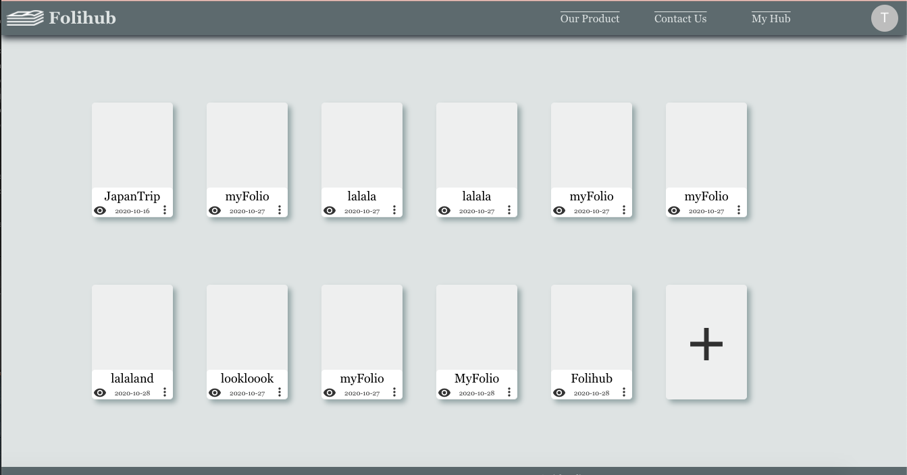
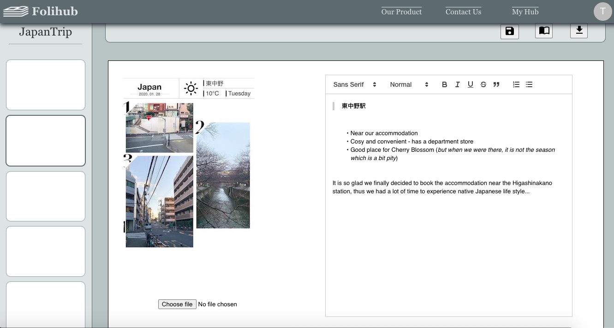
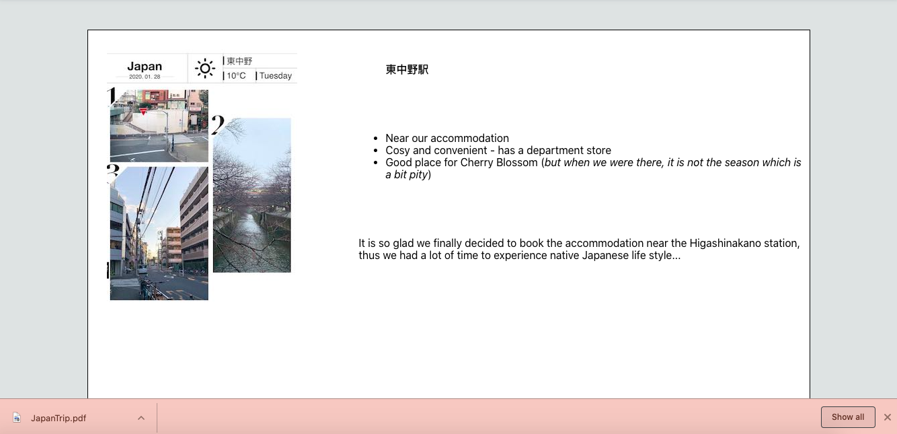
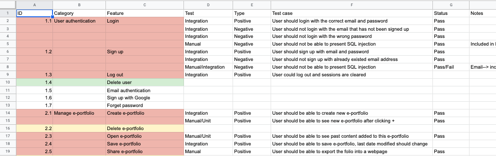

# Folihub
A online e-portfolio storing and sharing tool. Folihub provides template for users to choose, receive user's input text and uploaded images, and makes it an elegant e-portfolio. You could downloading it as a PDF and freely share with your friends. Let's do some e-portfolio today! :-)

## Installations
**Sprint 1**  
In sprint 1, frontend homepage, sign up, login and user homepage skeleton code are finished, and database is setted up for backend. However, the web app has not been deployed online, and could only be viewd locally. Hence, if you would like to access what we have done, you could:
* Clone or download the frontend code from branch "dev-frontend",
* Navigate to the folder and run "npm install" in terminal,
* "npm start" and view it on localhost: 3000.

**Sprint 2**  
Both the front-end and back-end codes have been deployed to Heroku server at the start of Sprint 2, now it is accessible from the link provided below in the "features and functionalities" section. To see the history of deployment, you could visit https://docs.google.com/document/d/1M4zP-DF4FyNYlP_QAWfYQ7CGlk627KqAxRMRvr1pCNs/edit  
The main feature that has been developed in sprint 2 is editing e-portfolio. For front-end, edit folio page has been implemented and Quill JS was decided to be used to assist rich text input. While for back-end, various APIs have been created for this functionality, such as creating new pages and new folios, renaming folios, saving folios and updating the contents. Testing has also been introduced and automated intergration tests using Mocha and Chai have executed over user authentication.  

**Sprint 3**  
Debug and testing are two main areas we worked during sprint 3. To see what features have been tested, you could access the testing documentations in document folder or directly visit the Google Sheet at https://docs.google.com/spreadsheets/d/1-wlu9MTsUhqct4dP7idWDdbHGg45FdmatDyInyoQG_c/edit?usp=sharing. We have noticed that there are some bugs on CORS policy between our back-end and front-end server due to not having a SSL certificate on Heroku (which requires payment to get). In result of that, we have to switch to http for all functionalities without SSL certificate (although this causes some security issue). As is usual, the links to access functionalities are provided below in the "features and functionalities" section.   

## Features and Functionalities
**Homepage**  
Homepage is avaliable for all users (those who have accounts) and visitors (those who do not have accounts). This page includes product introduction, which is mainly on "Secure", "Fast" and "Inspiring", and also gives users and visitors a taste of the style of our product.     
  
URL Link: http://folihub.herokuapp.com/  
  
**User Sign Up**  
This page is for visitors to sign up and use more advanced functionalities. Users are identified by an unique email address, and are required to set up a password, which is hashed and stored in the database. Sign up with Gmail is also planned to be implemented in future versions.  

URL Link: http://folihub.herokuapp.com/signup  

**User Login**  
This page is for users to log in and access stored e-portfolios, or create new ones. User email and password are required.

URL Link: http://folihub.herokuapp.com/login  

**User Homepage**  
User homepage displays all the e-portfolios the user owns. It can be accessed only after logged in. User can create new e-portfolios, or select past e-portfolios to edit from this page.  

  

  

**Edit Folio**  
Edit folio page is when user click existed e-portfolios or create new e-portfolios from user homepage. Previous work (or empty page) along with editing tools in tool bar are displayed to allow the user to design and update that page (the term "page" here refers to a "page" in the e-portfolio). User could add new pages to e-portfolio by clicking the "+" button on the bottom of the left bar as well.

  

    

**Export Folio**  
To export an e-portfolio, a url and PDF can be generated based on user selection. The url is a link to a web page presenting user's e-portfolio. User could share this link to viewers if the e-portfolios are set to be public. A PDF of that eportfoilo could also be downloaded.  

  

 

## In Case of Error Happens
Due to the timing issues, there are limitations on the code, which might cause bugs at some time. In case something wrong happens, the development team comes up the following list:  
**User Authentication:**  
* Check whether it is using http or https; the website only runs on http, or it will cause CORS policy issues.
* If failure to load content after login, check whether the email has been signed up. Only signed up emails could login.
* If not wanting to sign up, a testing account could be used, which is as follows, with “JapanTrip” e-portfolio as the example e-portfolio for testing:
> Email: test@folihub.com  
> Password: aa  

**User Homepage**  
* Only clicking on the e-portfolio name could open the e-portfolio, clicking on the card container causes the change of color but does not trigger any action.  

**Edit E-portfolio**  
* It is possible that the image fails to be uploaded, in most situations it is because “payload is too large”. Please try uploading some other image instead.  
* Deleting page functionality is not implemented as it is not labeled as a “high priority” task, however the icon (button) has been created. Clicking the delete page button triggers nothing.  
* After uploading images and text, the “save button” (the first button on the top navigation button) should be clicked before moving to the next page, or the data will not be uploaded to the database.  

**If you have an concerns, please do not hesitate to contact us with email.**

## Documentations Included
**Included in "Documentations_and_Models" folder**  
* Documentation Index (Index of all documentations and structures on Google Drive)
* Agile Development Folder
  * sprint backlog
* Architecture Folder
  * past models folder (old entity relationship models)
  * class diagram
  * architecture model
  * entity relationship model
  * page-to-page logic
  * sequence diagram
* Meeting Minutes Folder
  * standup and group meeting minutes
  * client interview notes
  * sprint review slides
* Product Folder
  * Do/Be/Feel model
  * motivation model
  * user stories (as the product backlog)
  * testing documentation
  * deployment documentation
  * product report
* Presentation Folder
  * product presentation slides (.pptx)

**Axure Prototype**  
https://zele5k.axshare.com/  

**Trello board**  
https://trello.com/b/YKcZYnsR/it-project-team-11   

**API Documentation**  
https://apizza.net/pro/#/project/7e84eca3c93d8bca570937c389018dbe/browse  

**Google Drive**  
https://drive.google.com/drive/folders/1lw9btbpFqWp7t7XuJI8qckoxfXTZ-9LF?usp=sharing  

## Test Cases, Changelogs and Detected Bugs

  

> For details, please see testing documentation and user stories in /Documentations_and_Models/Product/

## Team Members  
| Role | Name |
| ----------- | ----------- |
| Product Owner | Yunwei Wu |
| Scrum Master | Yifei Zhu |
| Development Team | Haoyang Yu |
| | Ruijie Pan
| | Danlei Mou
| | Yifei Zhu

##  MIT License

This repository is under MIT license, which is chosen because of its liscence compatibility. Please refer to LICENSE file for more detailed information.
